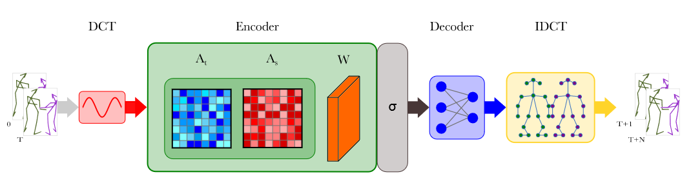
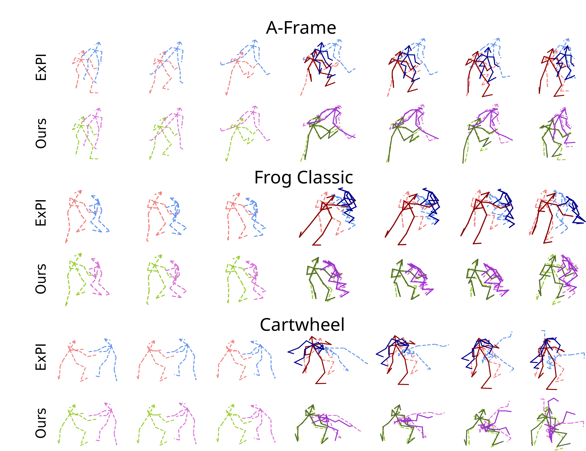

# Best practices for 2-Body Pose Forecasting

[](https://paperswithcode.com/sota/multi-person-pose-forecasting-on-expi-common?p=best-practices-for-2-body-pose-forecasting)
[](https://paperswithcode.com/sota/multi-person-pose-forecasting-on-expi-unseen?p=best-practices-for-2-body-pose-forecasting)

<p align="center">
    <a href="https://pytorch.org/get-started/locally/"></a>
    <a href="https://wandb.ai/site"></a>
    <a href="https://black.readthedocs.io/en/stable/"></a>
</p>

The official PyTorch implementation of the **5th IEEE/CVF CVPR Precognition Workshop** paper [**Best Practices for 2-Body Pose Forecasting**](https://openaccess.thecvf.com/content/CVPR2023W/Precognition/html/Rahman_Best_Practices_for_2-Body_Pose_Forecasting_CVPRW_2023_paper.html).

Visit our [**webpage**](https://www.pinlab.org/bestpractices2body) for more details.



## Content
```
.
├── assets
│   ├── poses-viz.png
│   └── teaser.png
├── dataset
│   └── pi
├── env.yaml
├── log
├── README.md
├── snapshot
│   └── model-iter-40000.pth
├── src
│   ├── datasets
│   │   ├── data_utils_pi3d.py
│   │   ├── pi3d_hier.py
│   │   ├── pi3d.py
│   │   └── vis_2p.py
│   ├── model.py
│   ├── test.py
│   ├── train.py
│   └── utils
│       ├── angle_to_joint.py
│       ├── config.py
│       ├── logger.py
│       ├── misc.py
│       ├── parser.py
│       ├── pyt_utils.py
│       ├── rigid_align.py
│       ├── util.py
│       └── visualize.py
└── viz
```
## Setup
### Environment
```
conda env create -f env.yaml
conda activate bp42b
```

### Dataset
Request ExPI dataset [here](https://team.inria.fr/robotlearn/multi-person-extreme-motion-prediction/) and place the `pi` folder under `datasets/`.

## Training
```
PYTHONPATH=. python src/train.py
```

## Test
```
PYTHONPATH=. python src/test.py
```

### Visualization
```
PYTHONPATH=. python src/test.py --visualize
```
## Results
### Quantitative
On the common action split of ExPI dataset, we achieve the following results:
|       |   5   |   10  |   15  |   25  |
|   -   |   -   |   -   |   -   |   -   |
| MPJPE |   40  |  87.1 | 130.1 | 201.3 |
| AME   |   25  |  53   |  76   | 110   |

On the unseen action split of ExPI dataset, we achieve the following results:
|       |   10  |   15  |   20  |
|   -   |   -   |   -   |   -   |
| MPJPE | 110.4 | 161.7 | 205.3 |
| AME   |   65  |  93   | 114   |

### Qualitative


## Citation
```
@InProceedings{Rahman_2023_CVPR,
    author    = {Rahman, Muhammad Rameez Ur and Scofano, Luca and De Matteis, Edoardo and Flaborea, Alessandro and Sampieri, Alessio and Galasso, Fabio},
    title     = {Best Practices for 2-Body Pose Forecasting},
    booktitle = {Proceedings of the IEEE/CVF Conference on Computer Vision and Pattern Recognition (CVPR) Workshops},
    month     = {June},
    year      = {2023},
    pages     = {3614-3624}
}
```


## Acknowledgements
We build upon [siMLPe](https://github.com/dulucas/siMLPe) and take some code from [MultiMotion](https://github.com/GUO-W/MultiMotion).
